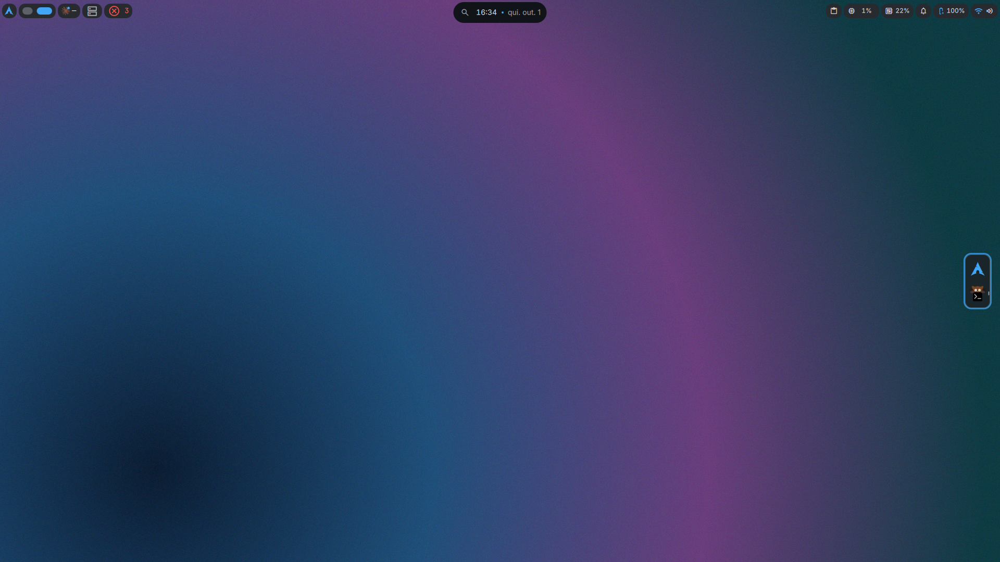
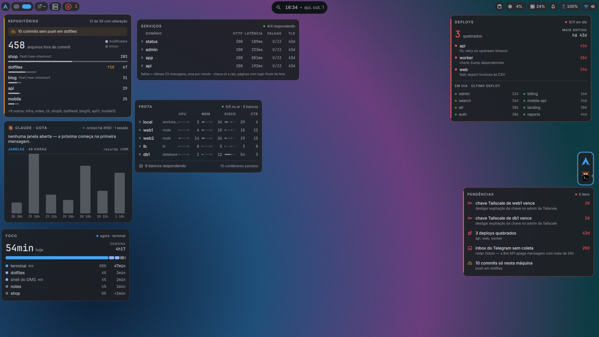
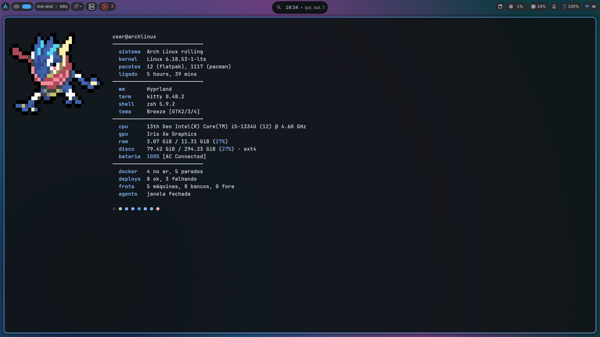

# hypr-dms-rice

Rice de Arch Linux com **Hyprland (config em Lua)**, **DankMaterialShell** e
**matugen** — e um monitor de desenvolvimento na barra: cota do Claude Code,
deploys do GitHub Actions, servidores e sites, com alertas só quando algo muda.

> *Arch Linux rice: Hyprland (Lua config), DankMaterialShell, matugen theming,
> plus a status-bar monitor for Claude Code quota, GitHub deploys, servers and
> websites. Comments and docs are in Brazilian Portuguese.*



<table>
<tr>
<td></td>
<td></td>
</tr>
<tr>
<td align="center">Widgets opcionais de área de trabalho</td>
<td align="center">kitty + fastfetch com o estado do ambiente</td>
</tr>
</table>

<sub>Prints com dados de demonstração. O wallpaper é o `wallpapers/aurora.png` do repositório, gerado para ele.</sub>

## O que tem

- **Tema derivado do wallpaper.** O matugen gera a paleta a partir da imagem e
  recolore Hyprland, kitty, hyprlock, starship, fuzzel, GTK, lazygit e zellij.
  Wallpaper por tela (`Super+Shift+W`); as cores seguem a tela principal.
- **Hyprland em Lua** (0.56+), separado em `hyprland.lua`, `monitors.lua`,
  `rules.lua`, `keybinds.lua`. Atalhos espelham o KDE para quem vem do Plasma.
- **ricestat** — coletor em Go que alimenta os plugins da barra e manda
  notificação de desktop na mudança de estado. Ver [`ricestat/README.md`](ricestat/README.md).
- **Plugins do DankMaterialShell** em `dms-plugins/`:

| Plugin | Mostra |
|---|---|
| AgentMeter | tempo restante e uso da janela de 5 h do Claude Code, histórico por hora |
| Pulse (Infra) | servidores e sites; acende só quando algo pede atenção |
| DeployRadar | último deploy de cada repositório, deploy rodando ao vivo |
| Fleet, Services, Repos, Focus, Pending, Tailnet | widgets de área de trabalho opcionais |

## Requisitos

- Arch Linux (o `install.sh` usa `pacman`) e Hyprland **0.56 ou mais novo**
- [DankMaterialShell](https://github.com/AvengeMedia/DankMaterialShell) (`dms-shell` no AUR)
- Go 1.27+ para compilar o `ricestat`
- Opcional: `gh` autenticado (deploys), SSH sem senha para os servidores (Infra),
  Tailscale (nós e chaves), Claude Code (cota)

## Instalação

```bash
git clone https://github.com/jvS0uzx/hypr-dms-rice ~/dotfiles
cd ~/dotfiles && ./install.sh
```

O script faz backup das configs que o `stow` vai assumir, instala os pacotes,
compila o `ricestat`, habilita a unit de usuário e liga os plugins no DMS.

Depois, configure o que quiser monitorar (todos os arquivos vêm comentados):

| Arquivo | Para |
|---|---|
| `~/.config/ricestat/hosts.txt` | servidores via SSH (somente leitura) |
| `~/.config/ricestat/repos.txt` | repositórios com `.github/workflows/deploy.yml` |
| `~/.config/ricestat/services.txt` | sites (status HTTP e certificado) |
| `~/.config/ricestat/code-roots.txt` | pastas com repositórios git locais |

Para o percentual oficial da cota do Claude, encaixe
`ricestat/statusline/claude-statusline.sh` na frente da sua status line
(instruções no README do ricestat).

## Atalhos principais

| Atalho | Ação |
|---|---|
| `Super+T` / `Super+Enter` | terminal |
| `Super+R` | lançador |
| `Super+X` / `Alt+F4` | fechar janela |
| `Super+Shift+W` | wallpaper (escolhe a tela) |
| `Super+\`` | widgets por cima das janelas |
| `Super+Shift+\`` | widgets entre a tela principal e a externa |
| `Super+Shift+Esc` | sair do Hyprland sem depender do shell |

Lista completa em `hypr/.config/hypr/keybinds.lua`.

## Segurança

- O coletor só **lê**: o probe SSH lê `/proc`, `df` e `docker ps`; os sites
  recebem um GET na raiz. Nada escreve em servidor.
- Nenhum segredo vai para o repositório nem para o snapshot (que fica em
  `$XDG_RUNTIME_DIR`, acessível só pelo usuário).
- Texto de terceiros (título de commit, erro de servidor) é escapado antes de
  virar notificação.
- O controle remoto do kitty fica **desligado**: com ele ligado, qualquer
  processo da sessão pode mandar o terminal executar comandos.

## Estrutura

Cada pasta de primeiro nível é um pacote do `stow` e espelha `$HOME`. Arquivos
que o matugen regrava (cores) não são pacotes: ficam em `seeds/` e o
`install.sh` copia como arquivos reais.

## Licença

[MIT](LICENSE).
